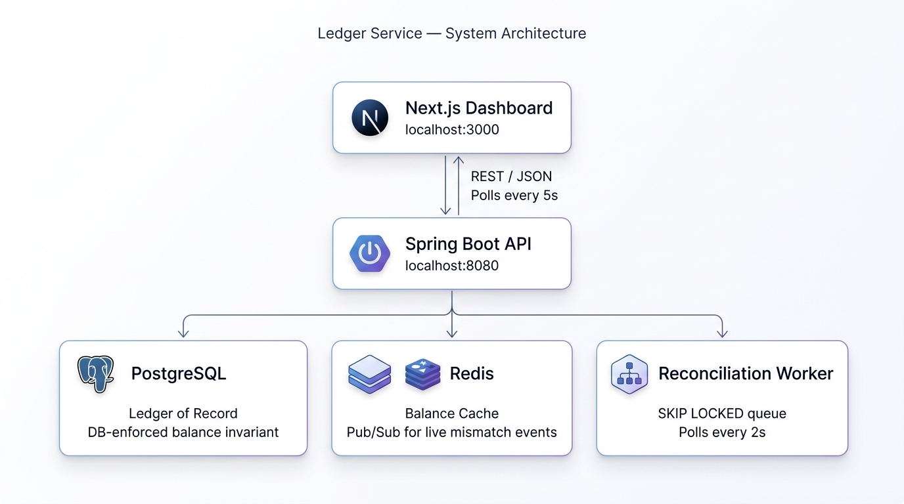

# Ledger — Payment Reconciliation Service

<!-- Replace YOUR_USERNAME/ledger-service with the actual GitHub path once pushed -->
[](https://github.com/fish-dt/ledger-service/actions/workflows/ci.yml)
[](LICENSE)

A double-entry ledger that catches the moment your internal records and your
payment processor's records disagree — the same class of problem Stripe's
internal ledger, and every fintech reconciliation job, exists to solve.
Money must never be double-counted or silently lost, even under retries or
partial failures.

**Backend:** Spring Boot, PostgreSQL, Redis — a ledger where posting an
unbalanced transaction is structurally impossible (enforced by the database
itself, not just application code), paired with an async worker that
reconciles uploaded processor payout files against it.

**Frontend:** a multi-route Next.js dashboard, each page demonstrating a
specific backend guarantee — not a static mockup, a real app talking to the
live API.

## Architecture

<p align="center">
  
</p>

## How it works

1. Payments post into the ledger — money moving between accounts, the thing
   a payments system does every day.
2. Periodically, the payment processor (Stripe, Adyen, whoever) delivers a
   file of what *it* thinks happened.
3. The reconciliation worker compares the two and reports, precisely: which
   payments disagree on amount, which exist only on one side, and which
   reference numbers appear twice by mistake.
4. Every result is visible on the dashboard or retrievable via the API.

## Try it yourself

Everything below is free to run — no cloud account, no API keys, no GPU.

**1. Start the backend** (Postgres + Redis + the API):

```bash
cp .env.example .env   # fill in a DB password
docker compose up --build
```

Flyway runs the schema migrations automatically. Four accounts are seeded:
Processor Clearing, Merchant Payable, Platform Revenue, Platform Fee.

**2. Start the dashboard** (second terminal):

```bash
cd frontend
npm install
cp .env.local.example .env.local
npm run dev
```

Open `http://localhost:3000`.

**3. Generate activity.** This script posts real transactions through the
live API, then writes a CSV deliberately designed to disagree with them in
four specific ways:

```bash
python scripts/generate_payout_csv.py --count 10
```

**4. Upload the file** — either through the dashboard's **Reconciliation**
page, or:

```bash
curl -X POST localhost:8080/api/reconciliation/jobs -F "file=@payout.csv"
```

**5. Watch it resolve.** Within a few seconds the job moves from `Pending` →
`Processing` → `Done`, and the mismatch triage page shows exactly the four
discrepancies the script injected.

## The dashboard, page by page

| Route | What it demonstrates |
|---|---|
| `/` | Account balances, recent reconciliation activity, open flags |
| `/post` | Posts a transaction live against the API. Try an unbalanced one and watch the server reject it — the real validation, not a client-side guess. A second button fires the same idempotency key twice to show a retried request never double-posts |
| `/transactions/[id]` | The debit/credit breakdown for a single transaction, with the sum-to-zero proof made visible |
| `/reconciliation` | Upload a processor payout CSV, with every row validated in the browser before it's sent |
| `/reconciliation/[jobId]` | Mismatch triage — filterable, sortable, with resolve/ignore actions and bulk operations |
| `/accounts` | Every account in the ledger and its live balance |

## What it demonstrates

| Pattern | Where |
|---|---|
| **Idempotency** | Retried transactions with the same key never double-post — enforced by a unique constraint, not just an in-memory check |
| **Outbox pattern** | Ledger entries and the outbox row commit in the same transaction, so the ledger and downstream notifications can never disagree |
| **Queue / async worker** | `SELECT ... FOR UPDATE SKIP LOCKED` — used by both the outbox relay and the reconciliation job queue, so multiple workers could run without double-processing a row |
| **Database-enforced invariant** | A `DEFERRABLE CONSTRAINT TRIGGER` makes it structurally impossible to commit an unbalanced ledger transaction |
| **Deliberate indexing** | A composite index matching the exact shape of the balance-lookup query |
| **Caching with explicit invalidation** | Redis-cached account balances, invalidated on write, not TTL-only |
| **Kubernetes** | Helm chart with an HPA (2→6 replicas on CPU), zero-downtime rolling updates, and readiness/liveness probes backed by Spring Boot Actuator |
| **CI/CD** | GitHub Actions: build → integration tests against a real Postgres → Docker build → push to GHCR → Helm lint/render → guarded deploy |

## Tech stack

Spring Boot · PostgreSQL · Redis · Next.js · TypeScript · Tailwind CSS ·
TanStack Query · TanStack Table · Docker · Kubernetes · Helm · GitHub Actions

## Project structure

```
ledger-service/
├── src/main/java/com/portfolio/ledger/
│   ├── entity/        Account, LedgerTransaction, LedgerEntry, OutboxEvent,
│   │                  ReconciliationJob, ProcessorPayoutRow, MismatchFlag
│   ├── service/        LedgerPostingService (core), OutboxRelayService,
│   │                  BalanceCacheService, ReconciliationUploadService,
│   │                  ReconciliationWorkerService
│   ├── controller/     REST API
│   └── repository/     Spring Data JPA
├── src/main/resources/db/migration/   Flyway migrations (schema + the
│                                      balance-invariant trigger live here)
├── src/test/            Integration tests against a real Postgres
├── frontend/
│   ├── app/             Routes — see the table above
│   ├── components/      UI, including the reusable primitives in ui/
│   └── lib/              Typed API client, TanStack Query hooks, demo-mode
│                        fixtures, zod schemas
├── helm/ledger-service/ Helm chart for Kubernetes
├── k8s/local/            Postgres + Redis manifests for a local kind cluster
├── scripts/              Test-data generator
└── .github/workflows/    CI/CD pipeline
```

## Testing

```bash
mvn clean verify
```

Integration tests run against a real Postgres (via Testcontainers, not
mocks) and prove the actual invariants: unbalanced transactions are
rejected, retried idempotency keys don't double-post, and all four
reconciliation mismatch types are genuinely detected.

```bash
cd frontend && npm run build && npm run lint
```

## Deploy to Kubernetes (local, free)

<details>
<summary>Full walkthrough — uses <code>kind</code>, no managed cloud account needed</summary>

```bash
kind create cluster --name ledger

# No password is committed anywhere in this repo.
source .env
kubectl create secret generic postgres-secret \
  --from-literal=POSTGRES_PASSWORD="$DB_PASSWORD"

kubectl apply -f k8s/local/postgres.yaml
kubectl apply -f k8s/local/redis.yaml
kubectl wait --for=condition=ready pod -l app=postgres --timeout=120s
kubectl wait --for=condition=ready pod -l app=redis --timeout=120s

docker build -t ledger-service:local .
kind load docker-image ledger-service:local --name ledger

helm install ledger helm/ledger-service \
  --set image.repository=ledger-service \
  --set image.tag=local \
  --set secrets.dbPassword="$DB_PASSWORD"

kubectl rollout status deployment/ledger-ledger-service
kubectl port-forward svc/ledger-ledger-service 8080:80
```

The chart sets `maxUnavailable: 0` on rolling updates so capacity never
drops during a deploy, an HPA scaling 2→6 replicas on CPU, and a readiness
probe against `/actuator/health/readiness` — which fails if the pod can't
reach Postgres or Redis, pulling it out of service without being killed and
restarted.

</details>

## CI/CD

`.github/workflows/ci.yml` runs on every push: builds, runs the integration
test suite against a real Postgres, builds the Docker image, pushes to
GHCR, then lints and renders the Helm chart. The deploy step runs only when
explicitly enabled via a repository variable, so the pipeline demonstrates
the full path from commit to deploy without requiring a cluster running
around the clock.

## Notable engineering decisions

- **Outbox pattern instead of publish-after-commit.** A direct publish
  after commit can fail and silently drop an event. The trade-off is added
  complexity — a relay process polling the outbox table — in exchange for a
  guarantee that the ledger and downstream notifications can never disagree.
- **Schema lives in Flyway migrations, not JPA `ddl-auto`.** The
  balance-invariant trigger can't be expressed as a JPA annotation, so
  Hibernate is configured to only *validate* against the schema, never
  generate or alter it.
- **Integer cents, never floating point**, anywhere money is represented —
  on the backend or in the frontend's form handling.
- **No `@Lock` on the native `SKIP LOCKED` queries.** The native SQL already
  performs the row lock; stacking Spring Data's `@Lock` annotation on top
  conflicts with Hibernate's own lock handling.
- **The reconciliation join key is the same `idempotency_key`** used to
  dedupe the original post, rather than a separate mapping table — the
  processor's own event/transfer ID is exactly what gets passed as that key
  when posting from their webhook in the first place.

## License

MIT — see [LICENSE](LICENSE).
